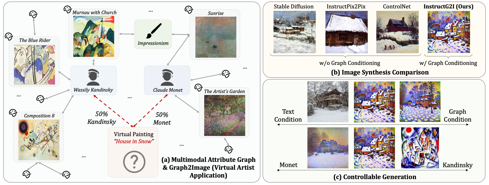
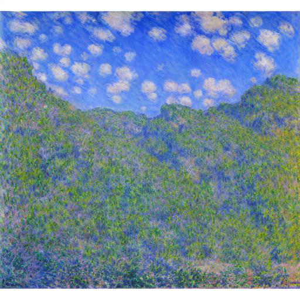
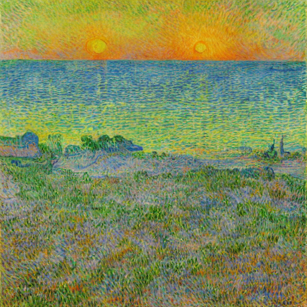
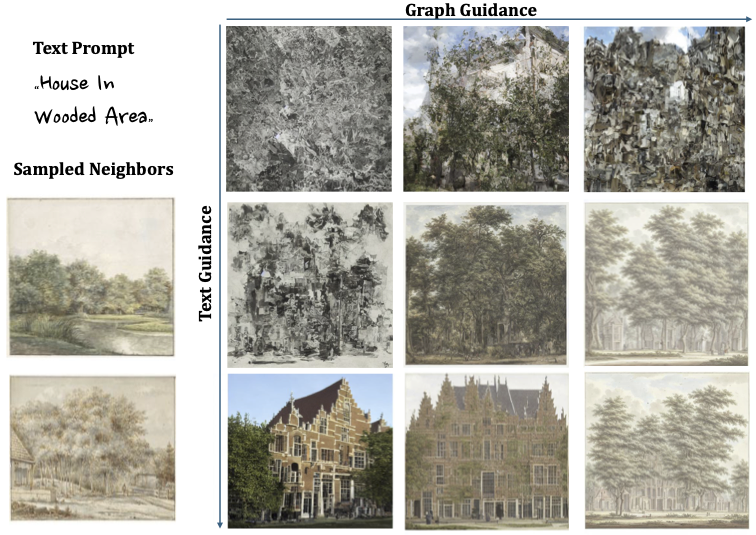
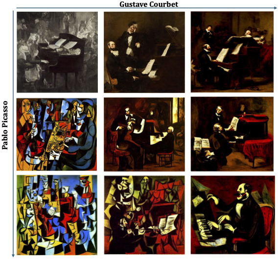

# InstructG2I: Synthesizing Images from Multimodal Attributed Graphs

<a href='https://ip-adapter.github.io'></a> 
<a href='https://arxiv.org/abs/2308.06721'></a>

---

## Introduction

We propose a graph context-conditioned diffusion model called **InstructG2I** to generate images from multimodal attributed graphs (MMAGs).
InstructG2I first exploits the graph structure and multimodal information to conduct informative neighbor sampling by combining personalized page rank and re-ranking based on vision-language features. 
Then, a Graph-QFormer encoder adaptively encodes the graph nodes into an auxiliary set of graph prompts to guide the denoising process of diffusion. 
Finally, we propose graph classifier-free guidance, enabling controllable generation by varying the strength of graph guidance and multiple connected edges to a node.



## Links

- [Installation](#installation)
- [Quick Start](#quick-start)
- [Download Models](#download-models)
- [Download Data](#download-data)
- [Playground](#playground)
- [Model Training](#model-training)
- [Model Testing](#model-testing)
- [Citations](#citations)

## Installation
```
conda create --name instructg2i python==3.10
conda activate instructg2i

git clone https://github.com/PeterGriffinJin/InstructG2I.git
conda install pytorch==2.0.1 torchvision==0.15.2 torchaudio==2.0.2 pytorch-cuda=11.8 -c pytorch -c nvidia
pip install -e .
```

## Quick Start

Generate a picture called *a mountain in the blue sky* under Claude Monet's style .

```
import os
from PIL import Image
from instructg2i import InstructG2IPipeline, get_neighbor_transforms

text_prompt = 'a mountain in the blue sky'  # a man playing soccer, a man playing piano
neighbor_pic_dir = 'examples/monet_pictures'

neighbor_transforms = get_neighbor_transforms(resolution=256)
pipeline = InstructG2IPipeline.from_pretrained("PeterJinGo/VirtualArtist", neighbor_num=5, device='cuda:0')

neighbor_image = [neighbor_transforms(Image.open(f'{neighbor_pic_dir}/{n_file}').convert("RGB")) for n_file in os.listdir(neighbor_pic_dir)]
image_gen = pipeline(prompt=text_prompt, neighbor_image=neighbor_image, neighbor_mask=[1] * len(neighbor_image), num_inference_steps=100).images[0]
image_gen.show()
```




Generate a picture called *a house in the snow* combining the style of Claude Monet  and my little brother .
```
import os
from PIL import Image
from instructg2i import image_grid, InstructG2IMultiGuidePipeline, get_neighbor_transforms

# load the model
pipeline = InstructG2IMultiGuidePipeline.from_pretrained("PeterJinGo/VirtualArtist", neighbor_num=5, device='cuda:0')

# configuration
text_prompt = 'a house in the snow'  # a man playing soccer, a man playing piano
scale_as = [0, 3, 10]
scale_bs = [0, 5, 15]

# read the sampled neighbors
path1 = "examples/monet_pictures"
path2 = "examples/children_pictures"
neighbor_images = [[neighbor_transforms(Image.open(os.path.join(path1, n_file)).convert("RGB")) for n_file in os.listdir(path1)],
                   [neighbor_transforms(Image.open(os.path.join(path2, n_file)).convert("RGB")) for n_file in os.listdir(path2)]]
neighbor_masks = [[1,1,1,1,1],
                   [1,1,1,1,1]]

# generation
image_gens = []
neighbor_transforms = get_neighbor_transforms(resolution=256)
for scale_a in scale_as:
    for scale_b in scale_bs:
        graph_guidance_scales = [scale_a, scale_b]

        image_gen = pipeline(prompt=text_prompt, 
                                        neighbor_images=neighbor_images, 
                                        neighbor_masks=neighbor_masks, 
                                        graph_guidance_scales=graph_guidance_scales,
                                        num_inference_steps=100).images[0]
        image_gens.append(image_gen)
res_grid = image_grid(image_gens, len(scale_as), len(scale_bs))
res_grid.show()
```


## Download Models

### Image Encoder
Create an image_encoder folder by ```mkdir image_encoder```, then place the files downloaded [here](https://drive.google.com/drive/folders/1AtbN401MDSVLZlH5webITfskkIIjUPLZ?usp=sharing) into the folder.

### InstructG2I checkpoints

The virtual artist InstructG2I checkpoint which is trained on Artwork graphs can be downloaded [here](https://drive.google.com/drive/folders/1ntmPgZXmb-M-k5M0Cnh34p0fxoeKnnYC?usp=sharing) or [here](https://huggingface.co/PeterJinGo/VirtualArtist).

```
from huggingface_hub import snapshot_download
snapshot_download(repo_id="PeterJinGo/VirtualArtist", local_dir=your_local_path)
```

The InstructG2I checkpoints for the Amazon graph and Goodreads graph can be found [here](https://drive.google.com/drive/folders/1rPhc-LFoyqDrqn6gigTogFB7cEpRLx72?usp=sharing).

## Download Data

You can download the [Art dataset](https://drive.google.com/drive/folders/1HzMAHteJrkBYqq1yRfe6cTPTWxVLDCWq?usp=sharing), [Amazon dataset](https://drive.google.com/drive/folders/1GZBBp5CRK3DVNAVydsI97OEILYmy2tL7?usp=sharing) and [Goodreads dataset](https://drive.google.com/drive/folders/17Y7-tZlWG6mDqeZtesIjjo7MEpVa_J8W?usp=sharing) from the provided links. Put the datasets into the ```data/``` folder like below:

```
$CODE_DIR
    ├── checkpoint
    ├── data
    │   ├── Art
    │   │   ├── train
    │   │   └── test
    │   └── ...
    └── instructg2i
```

Inside both ```train/``` and ```test/``` folders, there is a ```metadata.jsonl``` file which indicates the training/testing data samples. Each row correspond to one data sample in a dictionary format:
```
{
    "center": "1934325.jpg", 
    "text": "The Way to Dusty Death", 
    "neighbors": ["26226.jpg", "142732.jpg", "230623.jpg", "118226.jpg", "1127830.jpg", "149628.jpg"]
}
```

```"center"``` indicates the image file for the center node, ```"text"``` corresponds to the text associated with the center node and ```"neighbors"``` is a list of sampled neighbors for the center node on the graph.


## Playground
### Generate a picture in a specific artist's style

[virtual_artist.ipynb](https://github.com/PeterGriffinJin/InstructG2I/blob/main/examples/virtual_artist.ipynb)




### Generate a picture by controlling the guidance weight from text and graph

[virtual_artist_TG_guidance.ipynb](https://github.com/PeterGriffinJin/InstructG2I/blob/main/examples/virtual_artist_TG_guidance.ipynb)



### Generate a picture by providing multiple graph guidance

[virtual_artist_multiG_guidance.ipynb](https://github.com/PeterGriffinJin/InstructG2I/blob/main/examples/virtual_artist_multiG_guidance.ipynb)



## Model Training
For training, you can make a training configuration file ```your_train_config.json``` and we provide a training configuration template [here](https://github.com/PeterGriffinJin/InstructG2I/blob/main/config/train_template.json).

```
accelerate launch --mixed_precision="fp16" \
                  --multi_gpu \
                  -m instructg2i.train \
                  --config config/your_train_config.json

```

We provide an example for training InstructG2I on the ART graph:
```
export CUDA_VISIBLE_DEVICES=6,7 
accelerate launch --mixed_precision="fp16" \
                  --multi_gpu \
                  -m instructg2i.train \
                  --config config/train_art.json

```

## Model Testing
For quantitative evaluation of the InstructG2I model, you can specify a testing configuration file ```your_test_config.json``` and we provide a testing configuration template [here](https://github.com/PeterGriffinJin/InstructG2I/blob/main/config/test_template.json).

```
python -m instructg2i.test --config config/your_test_config.json
```


We provide an example for testing InstructG2I trained on the ART graph:
```
python -m instructg2i.test --config config/test_art.json
```

## Citations
If you find InstructG2I useful for your research and applications, please cite using this BibTeX:
```bibtex

```
